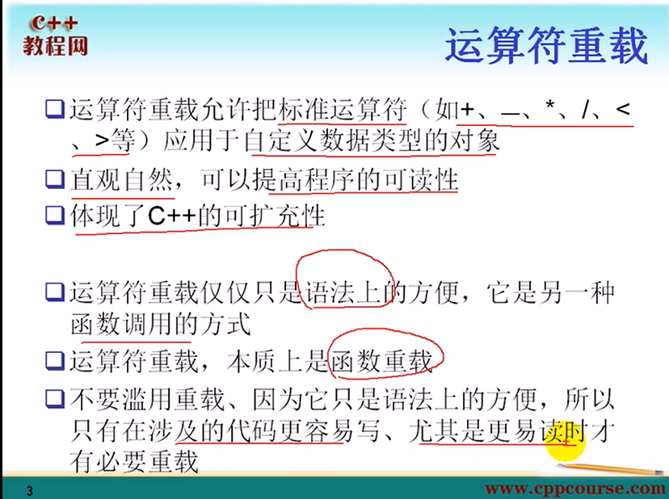
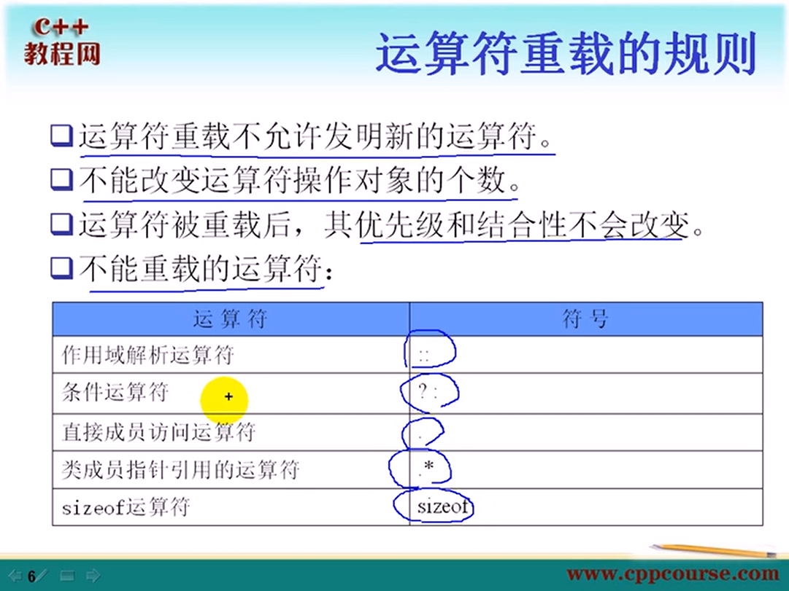
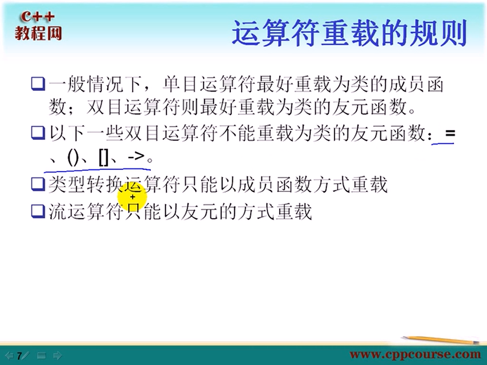

# 23 主要利用Complex.h 简单实现复数类
## 运算符重载
1.成员函数重载
2.非成员函数重载 利用友元函数

但二者不能共存，在C20当中



## 运算符重载规则




# 24
## ++符号重载 推进成员函数重载 Integer.h

## = 重载 String.h

## ！重载 String.h

# 25 
## [] 重载 String.h
    返回引用，可以使其能够出现在等号左边

    char& operator[](unsigned int index);

    const char& operator[](unsigned int index)const;  //const修饰的对象实例，无法出现在=左边，因为返回的是const类型引用

    用non const 版本调用const版本 过于抽象
    return const_cast<char&>(static_cast<const String&>(*this)[index]);
    // 转化为const对象，再调用[],再去除const属性。

    

## + 重载 String.h 友元方式

    为啥C20 字符串不能隐形转换为类引用？为啥不能同时两个隐式转换为类 
    视频源函数：friend String operator+(String& SS1, String& SS2);报错所以把& 删掉了，或者多写几个重载函数


## += 重载 String.h


## << 重载 String.h


## >> 重载 String.h

# 26 
## 类型转换符重载   Iterger.h
    1. 原型 operator 类名();
    2. 必须成员函数
    3. 没有参数？
    4. 不能指定返回参数，其实已经默认指定

## ->指针运算符的重载
    确定性析构,相当于用DB包装DBHelper，DB可以看做是一个智能指针

## operator new 和 operator delete 重载
### new 三种用法    test.h
    new operator    无法重载
    operator new    可以重载  一旦new 被重载，delete 也要被重载
    placement new

``` c++
    void* test::operator new(size_t size){
        cout<<"operator new(size_t size)"<<endl;
        void* p = malloc(size);
        return p;
    }
    void test::operator delete(void *p){    //优先
        cout<<"operator delete p"<<endl;
        free(p);
    }
    void test::operator delete(void *p, size_t size){
        cout<<"operator delete (void *p, size_t size)"<<endl;
        free(p);
    }
```  
### 全局new重载
``` c++
void* operator new(size_t size){
    cout<<"global operator new(size_t size)"<<endl;
    void* p = malloc(size);
    return p;
}
void operator delete(void *p){
    cout<<"global operator delete p"<<endl;
    free(p);
}
void operator delete(void *p, size_t size){
    cout<<"global operator delete (void *p, size_t size)"<<endl;
    free(p);
}
/*数组*/
void* operator new[](size_t size){
    cout<<"global operator new[](size_t size)"<<endl;
    void* p = malloc(size);
    return p;
}
void operator delete[](void *p){
    cout<<"global operator delete[] p"<<endl;
    free(p);
}
void operator delete[](void *p, size_t size){
    cout<<"global operator delete[] (void *p, size_t size)"<<endl;
    free(p);
}
```


### placement new 重载
``` c++
    void* operator new(size_t size, void *p){//placement new 重载
        return p;
    } 

    void operator delete(void *, void *){//placement new 重载
        // return p;
    } 
```

### 另一种operator new 重载
``` c++
    void* operator new(size_t size, const char* file , lone line){//
        cout<<"new"<<file<<":"<<line<<endl;
        void* p = malloc(size);
        return p;
    } 

    void operator delete(size_t size, const char* file , lone line){// 无效，不清楚原因
        cout<<"delete"<<file<<":"<<line<<endl;
        free(p);
    } 

```
